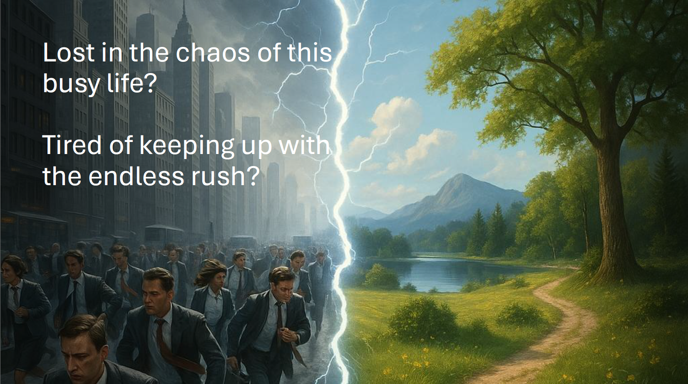
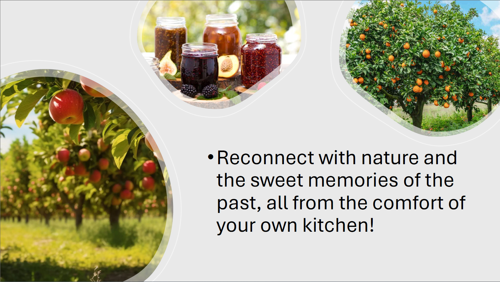
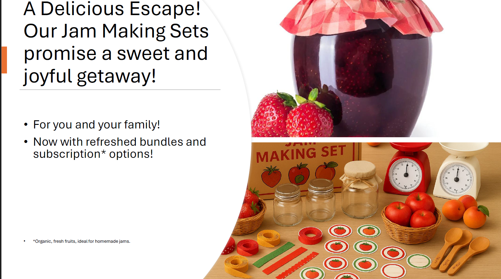
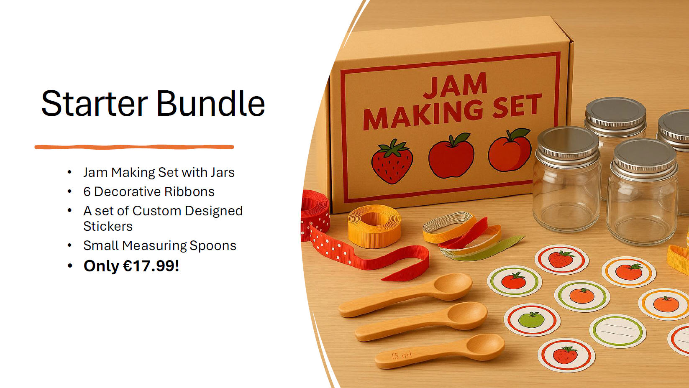
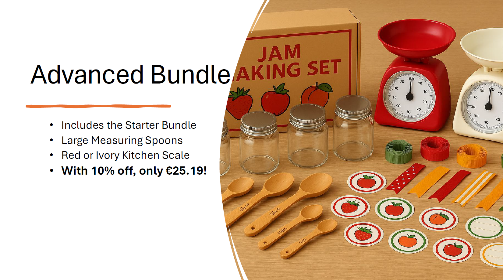
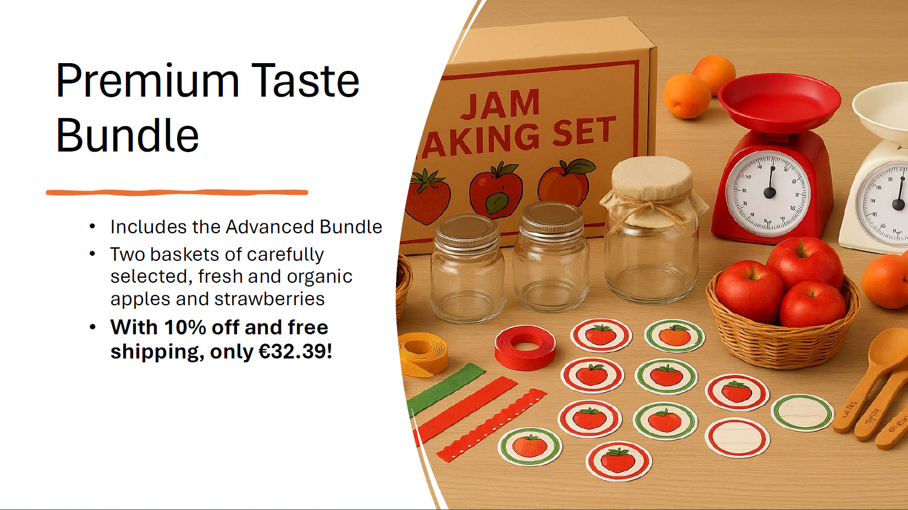
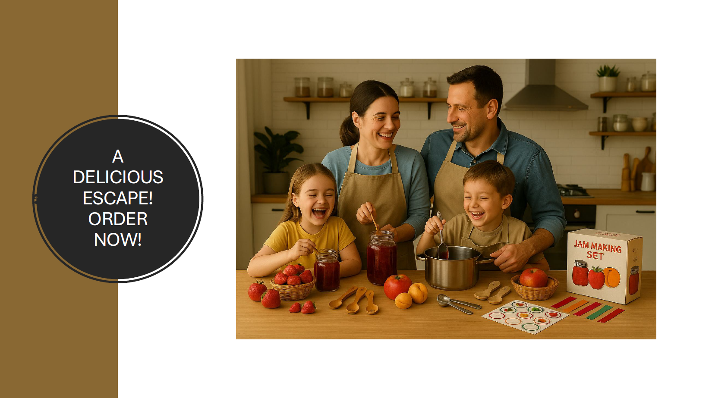

# A Delicious Escape | Market Basket Analysis & CRM Campaign

## Overview

A Delicious Escape is a retail analytics project combining **Market Basket Analysis (MBA)** and **RFM customer segmentation** on a UK-based online retail dataset. The analysis uncovered product co-purchase patterns, which were used to design a tiered bundle strategy and a Black Week discount campaign. RFM segmentation then enabled differentiated targeting of the resulting bundles to the right customer segments.

---

## Business Context

A Delicious Escape sells jam-making sets and related kitchen accessories. The project aimed to answer two questions:

1. **Which products are most frequently bought together?** → Design data-driven product bundles
2. **Who are the customers and how do they behave?** → Apply RFM segmentation for targeted campaigns

---

## Dataset

- **Source:** UK-based online retail transaction data
- **Key fields:** Product description, quantity, unit price, invoice date, customer ID
- **Scope:** Transactional data covering multiple years of retail purchases

---

## Methodology

### Part 1 — Market Basket Analysis

Association rules were generated to identify product co-purchase patterns:

| Metric | Description |
|--------|-------------|
| **Support** | % of all baskets containing the item |
| **Confidence** | % of target baskets also containing the associated item |
| **Lift** | How much more likely items are bought together vs. independently |

**Key findings from MBA:**
- **JAM MAKING SET WITH JARS** is the anchor product — present in 5.5% of all baskets with a lift of 18.1x when purchased alongside jam-related accessories
- **6 RIBBONS RUSTIC CHARM**, **SMALL HEART MEASURING SPOONS**, **LARGE HEART MEASURING SPOONS**, **IVORY/RED KITCHEN SCALES**, **JUMBO BAG APPLES**, **JUMBO BAG STRAWBERRY** all show strong association rules with the jam making set
- These associations directly informed the bundle composition

### Part 2 — Bundle Strategy

Three tiered bundles were designed based on association rule strength, with 2025 inflation-adjusted pricing (40% Eurozone average inflation since 2011 applied):

| Bundle | Contents | Price |
|--------|----------|-------|
| **Starter** | Jam Making Set with Jars, Jam Making Set Printed, 6 Ribbons Rustic Charm, Small Heart Measuring Spoons | **€17.99** |
| **Advanced** | Starter + Large Heart Measuring Spoons, Ivory or Red Kitchen Scales | **€25.19** (10% off) |
| **Premium Taste** | Advanced + Jumbo Bag Apples, Jumbo Bag Strawberry (fresh organic fruit) | **€32.39** (10% off + free shipping) |

*2025 inflation-adjusted prices: Starter €12.16 → €17.99 | Advanced €25.69 | Premium €31.33*

### Part 3 — RFM Segmentation

Customers were scored on **Recency**, **Frequency**, and **Monetary** value, then assigned to segments using quantile-based thresholds:

| Segment | FR Score | Description |
|---------|----------|-------------|
| Champions | 45, 55 | High frequency, recent buyers |
| Loyal Customers | 43, 44, 53, 54 | Consistent purchasers |
| Potential Loyalists | 24, 25, 34, 35 | Recent, growing frequency |
| New Customers | 15 | Just started buying |
| Promising | 14 | Recent, low frequency |
| Need Attention | 33 | Mid-tier, at risk of sliding |
| About to Sleep | 13, 23 | Declining activity |
| At Risk | 31, 32, 41, 42 | Previously active, now distant |
| Can't Lose Them | 51, 52 | High value but not recent |
| Hibernating | 11, 12, 21, 22 | Inactive |

---

## Campaign Output

The project culminated in a **Black Week discount campaign** targeting each RFM segment with the appropriate bundle tier:

- **Champions & Loyal Customers** → Premium Taste Bundle with personalised messaging
- **Potential Loyalists & Promising** → Advanced Bundle with upgrade incentive
- **At Risk & Can't Lose Them** → Starter Bundle with win-back discount
- **New Customers** → Starter Bundle with onboarding offer

The campaign materials were designed as a full presentation deck including brand storytelling, bundle visuals, and discount code structure.

---

## Key Findings

- JAM MAKING SET WITH JARS is the highest-lift anchor product in the dataset (lift: 18.1x)
- Strong co-purchase patterns exist within the jam-making accessory category, justifying a tiered bundle approach
- RFM segmentation revealed 10 distinct customer behavioural groups enabling highly differentiated campaign targeting
- Inflation-adjusted pricing (40% since 2011) was applied to ensure pricing relevance in the 2025 context

---
## Campaign Preview

## Deliverables

| File | Description |
|------|-------------|
| `A_-_CRM_MB_Data_Retail_Ham.xlsx` | Market basket analysis output + RFM segment scoring |
| `Black_Week_Discount_Code_and_Bundles.pptx` | Campaign presentation with bundle designs and discount strategy |
| `A_Delicious_Escape_Sarp_v2.pdf` | Full project report and campaign brief |

---

## Tools & Libraries

- **Python:** pandas, mlxtend (association rules), matplotlib, seaborn
- **Excel:** Association rule calculations, RFM scoring, bundle pricing model
- **PowerPoint:** Campaign design and presentation
